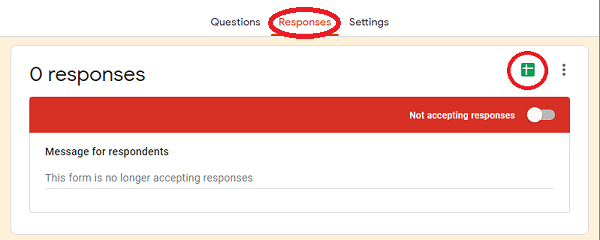
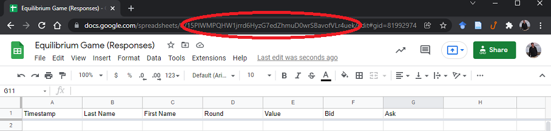

\pagenumbering{gobble}
\newpage
\pagenumbering{arabic}
\setcounter{page}{1}

# Introduction

The use of experiments as demonstrations of economic theory date back at least as far as those conducted by @chamberlin_experimental_1948 and @smith_experimental_1962. These studies were designed primarily to collect evidence supporting or refuting economic models of rational behavior in market settings. @holt_industrial_1993 summarizes this literature. While experiments remain an important method for observing behavior to test economic hypotheses, these experiments have also found their way into pedagogy [@deyoung_market_1993].

Classroom experiments offer students and instructors a fun departure from the usual "chalk and talk" of explaining economic models. In addition to entertainment value, studies have shown experiments to increase student learning in post-test assessments [@emerson_comparing_2004; @dickie_classroom_2006]. I should note, however, that not all studies conclude that all types of gamification improves learning by a significant margin: @gremmen_assessing_1997 find a positive effect of games on average, but the effect is not statistically significant, while @dickie_classroom_2006 finds that games do significantly improve learning, but that attaching grade incentives to the games do not contribute any additional benefit. Moreover, @stodder_experimental_1998 expresses concern that classroom games that penalize cooperation may teach and reinforce unethical decision making.

Despite the potential learning and entertainment value of classroom experiments, they remain relatively rare among the pedagogies economics professors adopt in their classrooms [@watts_little_2008]. Two factors may drive some of the hesitancy among economics instructors to implement classroom experiments. On the one hand, free resources, such as those described in the survey of non-computerized games by @brauer_games_2001, require significant time investments to tabulate and summarize the results. On the other hand, automated resources, especially those distributed by textbook publishers, impose a financial cost on students or their institutions that instructors feel rightly averse to asking budget-constrained students or departments to foot the bill for.

@cheung_using_2008 helps to overcome this barrier by building tools for collecting student responses to in-class non-computerized experiments using mobile phones and texting. This contribution furthers this by automating the process of calculating and summarizing the results of the experiments. These examples only require students to be able to access a Google Form via their browser on their computer or mobile device, which, given the ubiquity of mobile phones among students (sometimes as their only personal computing device), sets a fairly reasonable bar for accessibility. A secondary contribution is simplifying existing versions of classic market equilibrium, entry, and duopoly games with the hope of increasing the diversity of methods used by economics instructors in the classroom.

On the instructor's end, I have created a free, downloadable package called `econGame` for the *R* open-source statistical computing program. The tabulation programs run as either stand-alone functions in the *R* console, or for demonstration purposes as a html *Shiny* app that can open in a browser tab if desired. This allows the instructor to present the results of the experiment almost instantaneously after the students have submitted their responses.

# Description of the Experiments

The models I will describe in this paper encompass two well-established market equilibrium games known to the economics education literature [see, for example, @williams_economic_1993 and @brauer_games_2001], namely simplified versions of the pit market trading game introduced by @holt_classroom_1996 and the free entry and exit game introduced by @garratt_free_2000; and three games simulating different oligopoly models (Bertrand, Cournot, and Stackelberg). In the examples the "payoffs" students receive can be awarded to the students at the end of the games as "extra credit" points, or instructors may choose to encourage students to play the games strategically, but only "for the love of the game." I briefly describe the delivery of the games below.

## Pit Market Trading

@holt_classroom_1996 designed the pit market trading game for class sizes between 10 and 25 and takes about 40-50 minutes to explain the game, play a few rounds, and tabulate the results after each round. This game is an excellent illustration of supply and demand, competitive market equilibrium, consumer and producer surplus, and efficiency. The functions presented in this paper speed up the response-collection process to allow the experiment to work for larger classes. It also speeds up the calculation of the equilibrium and graphs the equilibrium. 

Before class, the instructor prepares (1) a Google Sheet assigning a random integer between 1 and 10 representing each student's value that they place on the asset;^[The first sheet consists of a single formula in a single cell: "=roundup(10*rand())". A template can be found at:  
https://docs.google.com/spreadsheets/d/1lCmC692ajsQZoatWtgZh5QKaJ9y3pOMt15JwRFaHanU/edit#gid=258904023.] and (2) a Google Form through which students enter their bid and ask prices;^[A template can be found at:  
https://docs.google.com/forms/d/1S_F9UJ6GXttxPqDLtk8Hg0ZgzDaHMxBmc1qH3W2gKZo/edit.] For the best compatibility with the result-tabulating function, users who create their own forms should use the question prompts "First Name," "Last Name", "Round," "Value," "Bid," and "Ask." Add text fields to insert additional context, instructions, or question text.

In class, the instructor informs the students that they own a single unit of an asset that each of them values differently. This value could represent a profit that they can derive from using the asset as a resource to produce other goods, a return the students expect to receive from selling the asset in the future, or a subjective "utility" that the students derive from using the asset as consumption. Students discover this value by visiting a link to the first Google Sheet that the instructor prepared to assign a random value from 1 to 10.

Students submit their name, the round number (if playing more than one), their randomly-assigned value draw, a "bid" corresponding to the highest amount they would pay for a second unit of the asset, and an "ask" corresponding to the lowest amount they would accept to part with the unit of the asset they already own.

If the instructor decides to incentivize the game with points, students keep their consumer and producer surpluses from each round as "extra credit" points. `equilibriumGame` tabulates the supply and demand schedules; calculates the equilibrium; graphs the equilibrium; and tabulates the scores for each student.^[The solution the piece-wise constant supply and demand equilibrium uses the help of a C++ helper function provided by "David" on Stack Overflow,  
https://stackoverflow.com/questions/23830906/intersection-of-two-step-functions.]

## Entry and Exit

@garratt_free_2000 designed an entry and exit game with four discrete specifications of the demand functions for class sizes between 25 and 44. Garratt's version also includes four markets (corn, wheat, rice, and soybeans), while the one presented here only includes two (corn and soybeans). The demand functions in this version of the experiment automatically adjust according to the number of students participating. Garratt's version of the game also takes about 45 minutes to complete the experiment (including a government "fallow program" intervention variation), usually about five rounds. 

Before class the instructor prepares a Form to collect responses that includes the fields "First Name," "Last Name," "Round," and "Market."^[A template can be found at:  
https://docs.google.com/forms/d/1oUsLulfD5bqT6_9VVYIzLWuuQ-L4vwmC4jI-1jabOVQ/edit.] Other information that might be useful to add to the Form includes information about demand and costs in each sector. The default inverse demand functions allow for each market to reward producers with about one unit of "normal profit," but these settings can be changed. 

In class, the instructor informs the students that they will choose to plant corn, soybeans, or nothing. Producing corn incurs a cost of four, while producing soybeans incurs a cost of 10. @garratt_free_2000 recommends that the instructor *not* reveal the demand functions to students, whereas some instructors (including me) might prefer to allow students to play with perfect information. Selling a unit of corn brings revenue equal to $P_c = (N/2) + 6 - Q_c$, where $N$ equals the number of students participating and $Q_c$ equals the number of students choosing to produce corn. Selling a unit of soybeans brings revenue equal to $P_s = (N/2) + 10 - Q_s$. These parameters allow for there to be a "normal profit" of about one unit per student in each market in equilibrium, to compensate for the risk of venturing into self-employment.^[The long run equilibrium, with 1 unit of "normal profit" occurs with $(N/2) + 1$ students choosing corn and $(N/2) - 1$ students choosing soybeans.] If the instructor wants the prices to equal whole numbers (and the profits to equalize), they can join the game as a "student" to round out the numbers.

If the instructor decides to play the game with points, students earn points equal to their profits. Students may play as many rounds as the instructor decides to continue the game, or until the markets reach the long run equilibrium of zero *economic* profit. Usually the markets converge to the long run equilibrium by the end of about five rounds. Padding the demand functions to leave one point of "normal profit" compared to sitting out simulates the concept of a normal profit business owners receive for taking risk and lessens the chances that students might "win" negative extra credit points. Students choosing to produce nothing sell their labor in the labor market and earn zero (they do not earn a normal profit).

## Oligoply Models

I also constructed a set of games to demonstrate and compare equilibria in different (two-firm) oligopoly models. In each of the examples, students work in pairs. The instructor informs the students that the market price depends on both the strategy they choose for their "firm" and also the strategy their partner chooses. Each of the three examples uses the following linear inverse demand function (the parameters of which individual instructors may change in the options): $P = a + b(Q_1 + Q_2),$ where the default values for the parameters are $a = 10$ and $b = -1$. Likewise, firms face the the same cost function: $TC = f + cQ_i,$ where $f$ represents the fixed cost (0 by default) and $c$ represents the (constant) marginal (and average) cost of each additional unit (6 by default).

Before beginning any of the duopoly models, the instructor should solve the competitive and monopoly equilibria with students first so that students can see the plausible range of prices they should expect to declare. Skipping this step often leads to a few greedy (but quantitatively-challenged) students choosing prices that would result in negative quantities. With the default parameters, the competitive equilibrium price and quantity are 6 and 4, while the monopoly equilibrium price and quantity are 8 and 2. 

### Bertrand Duoploy

Before class, the instructor prepares the Form to collect the responses, which includes the fields "First Name," "Last Name", "Partner First Name," "Partner Last Name," "Round," and "Price."^[A template can be found at:  
https://docs.google.com/forms/d/1AykOoY6mVj17D_5CW7-BLhSgOJdGEhyfYHKHROnvdcg/edit.] The package also includes a function to assign partners randomly using the class roster (saved as a Google Sheet), and the `bertrandGame()` function even allows the instructor to randomize the partners *after the fact* in case the instructor really wants to cut down on tacit collusion. The package default calculates the results using student-entered partners. 

In class, the instructor reviews the competitive and monopoly equilibria for the demand function in the example. The instructor then presents the "rules" for the Bertrand model as a "winner takes all" market. Students submit their own names, partner's names, and their price. 
$$
Q_1 = \begin{cases}
    0 & \text{if } P_1 > P_2 \\ 
    (10 - P_1)/2 & \text{if } P_1 = P_2 \\
    10 - P_1 & \text{if } P_1 < P_2 
\end{cases}
$$
If the instructor chooses to use points for the activity, students earn points equal to their profit. 

### Cournot Duopoly

Before class, the instructor prepares the Form to collect the responses, which includes the fields "First Name," "Last Name", "Partner First Name," "Partner Last Name," "Round," and "Strategy"^[A template can be found at:  
https://docs.google.com/forms/d/1dp-tUv5rNhRpm9UjFCy_pgsD4rJJnja-QJnWnMu81DI/edit.] As with the Bertrand game, instructors have discretion over allowing students to choose their own partners ("rivals") or randomizing the partners before or after the students choose a strategy.

In the Cournot game, students choose either to "collude" (produce a low quantity) or "defect" (produce a high quantity). The function that tabulates the results assigns half of the monopolist's profit-maximizing quantity to students who choose "collude," and automatically assigns the quantity corresponding to the best response function for students who choose "defect" (which depends on the output choice of their rival). Students only need to make the simple binary choice. Instructors using this example for upper-level classes may (or may not) want to edit the game settings to require students to submit a specific quantity (derive the best response functions themselves). 

### Stackelberg Duopoly

Similar to the Cournot game, students in the Stackelberg game choose to "collude" or "defect." In contrast to the Cournot game, students must know their partner in advance, and followers will see the leaders' strategy choices before choosing their strategy. The function again automatically calculates the quantities corresponding to the set of binary strategy choices to determine the payoff outcomes.[^A template can be found at:  
https://docs.google.com/forms/d/1vERPMPt_kW96JPAY6mEtkQMu6FLCgPuqoFL8i8bulYk/edit.]

# The econGame Package

The `econGame` package pulls activity data from Google the Google Sheet file generated for the form responses. It then tabulates, scores, and graphs the responses; and writes the grade data to a separate Google Sheet. Users can download the package from https://github.com/bangecon/econGame. To install the package, use the `remotes` package and the `install_github()` function:

`remotes::install_github("bangecon/econGame")`

## Exporting the Results

Once the students have completed each round of a game, the instructor should pause to tabulate the results for that round. This is especially the case in the entry and exit game, where convergence to the long-run equilibrium requires students to know which sector earned economic profits in the previous round. To do this, the instructor needs to click the Google Sheets icon in the responses tab of the edit page of the form. Figure 1 demonstrates where to find these tools in your Google Form.

This creates a Google Sheet that contains all of the data for tabulating the results.^[Link the Form to a Sheet to collect responses by selecting the "Responses" tab, and clicking "Link to Sheets."] 

In order to link to your results, you will need to copy to your clipboard the sheet ID from the URL. Figure 2 shows where you can find the sheet ID for your results.

## Tabulating the Results

Each game has its own function to tabulate its results, and for each function there are slightly different options that the instructor can adjust based on any changes they might have made to the default parameters for the exercise. The only argument the instructor needs to provide (and that does not have a preset default) is the ID of the Google Sheet. The syntax and outputs for the different functions are:

-   Equilibrium game: `equilibriumGame(sheet = NULL, ...)`

    -   Arguments:

        -   `sheet` (required) is a character string url corresponding to the Google Sheets location containing the individual submissions.

    -   Outputs:

        -   `type` returns the type of activity (equlibriumGame).
        -   `results` returns the original submissions (with market price and points added).
        -   `schedules` returns a list containing the supply and demand schedules for each round.
        -   `equilibria` returns a list containing the equilibria for each round.
        -   `grades` returns the aggregated points "won" by each student for the entire activity.

-   Entry and exit game: `entryGame(sheet = NULL, ...)`

    -   Arguments:

        -   `sheet` (required) is a character string url corresponding to the Google Sheets location containing the individual submissions.

    -   Outputs:

        -   `type` returns the type of activity (equlibriumGame).
        -   `results` returns the original submissions (with market price and points added).
        -   `rounds` returns the number of rounds in "results."
        -   `equilibria` returns a list containing the equilibria for each round.
        -   `grades` returns the aggregated points "won" by each student for the entire activity.

-   Bertrand game: `bertrandGame(sheet = NULL, a = 10, b = -1, c = 6, f = 0, ...)`

    -   Arguments:

        -   `sheet` (required) is a character string url corresponding to the Google Sheets location containing the individual submissions.
        -   `a` is the value of the intercept of the linear inverse-demand function (default is 10).
        -   `b` is the value of the slope of the linear inverse-demand function (default is -1).
        -   `c` is the value of the firm's marginal cost (default is 6).
        -   `f` is the value of the firm's fixed cost (default is 0).

    -   Outputs:

        -   `type` returns the type of activity (equlibriumGame).
        -   `results` returns the original submissions (with market price and points added).
        -   `grades` returns the aggregated points "won" by each student for the entire activity.

-   Cournot game: `cournotGame(sheet = NULL, a = 10, b = -1, c = 6, f = 0, ...)`

    -   Arguments:

        -   `sheet` (required) is a character string url corresponding to the Google Sheets location containing the individual submissions.
        -   `a` is the value of the intercept of the linear inverse-demand function (default is 10).
        -   `b` is the value of the slope of the linear inverse-demand function (default is -1).
        -   `c` is the value of the firm's marginal cost (default is 6).
        -   `f` is the value of the firm's fixed cost (default is 0).

    -   Outputs:

        -   `type` returns the type of activity (equlibriumGame).
        -   `results` returns the original submissions (with market price and points added).
        -   `grades` returns the aggregated points "won" by each student for the entire activity.

-   Stackelberg game: `stackelbergGame(sheet = NULL, a = 10, b = -1, c = 6, f = 0, ...)`

    -   Arguments:

        -   `sheet` (required) is a character string url corresponding to the Google Sheets location containing the individual submissions.
        -   `a` is the value of the intercept of the linear inverse-demand function (default is 10).
        -   `b` is the value of the slope of the linear inverse-demand function (default is -1).
        -   `c` is the value of the firm's marginal cost (default is 6).
        -   `f` is the value of the firm's fixed cost (default is 0).

    -   Outputs:

        -   `type` returns the type of activity (equlibriumGame).
        -   `results` returns the original submissions (with market price and points added).
        -   `grades` returns the aggregated points "won" by each student for the entire activity.

Another feature of the package is the ability to plot the results. The syntax to plot any of the games described in this paper is simply `plot(econGame, ...)`, where the (sole) argument is the name of an object assigned by one of the `econGame` functions. The plot the function generates depends on the type of game: 

* For `type = 'equilibriumGame'`, plot the supply and demand functions with the corresponding equlibrium point. 
* For `type = 'entryGame'`, plot the supply, demand, and per-unit cost lines to show profits and losses. 
* For `type = 'bertrandGame'`, plot a histogram of the price strategies. 
* For `type = 'cournotGame'` or `type = 'stackelbergGame'`, plot a bar graph of the strategy outcomes.

## Shiny User Interface

The functions for directly summarizing the results of the games may be useful for tabulating the results for the purposes of awarding points to the students who participated, but may not be the most visually-appealing way to present the results in class. To improve the user interface for a "prettier" presentation of the results, I have built a Shiny Application UI for each of the games. In this interface, the instructor can display the raw results, plots, or schedules of the outcomes of the results by inputting the sheet ID (and other parameters) in the input boxes, and by switching the display tabs of the results.

To run the Shiny App for a given package, I have written a function that executes the app from the `'~/inst/shiny-examples'` folder of the package source. Once the instructor has installed the package, all they need to do to execute the app is type one of the following commands: `'runEquilibriumGameApp()'`, `'runEntryGameApp()'`, `'runBertrandGameApp()'`, `'runCournotGameApp()'`, or `'runStackelbergGameApp()'`. When the instructor initiates the app, it will point the function to a blank Google Sheet as the default, which will result in either blank output, or an error. In order to read the submission results, the instructor will need to paste the Google Sheet ID depicted in Figure 2. 

Figure 3 shows the Shiny interface for `equilibriumGame`. Within the output panel, the instructor (and students) will be able to see tabbed output for different results, plots, and possibly the grade outcomes if the instructor wishes to show it. 

# Discussion

This work provided examples of how to implement some simple market games using R and Shiny. The objective of the functions developed for this discussion was to help instructors adopt more creative and engaging teaching methods in their principles classrooms by lowering both the financial and time costs of tabulating the results and presenting appealing summaries of the outcomes. 

All of the examples can be implemented for the students using Google Forms, which collects the results in Google Sheets. Instructors may then tabulate the results using the `econGame` package via the HTML Shiny App with a single-function command in R. All of these applications and packages come at no cost to the student. The only potential cost barrier is the device - which could be as little as a mobile device - each student would need in order to input their responses. 

Another useful feature is that I have platformed the package on GitHub, which allows users to make pull requests to suggest edits and changes to improve or add features and examples to the package. I plan to also develop more functions and applications for the `econGame` package from existing classroom experiments, and even design a few original games. If you use these resources, please let me know and share them with your colleagues. 

# References

